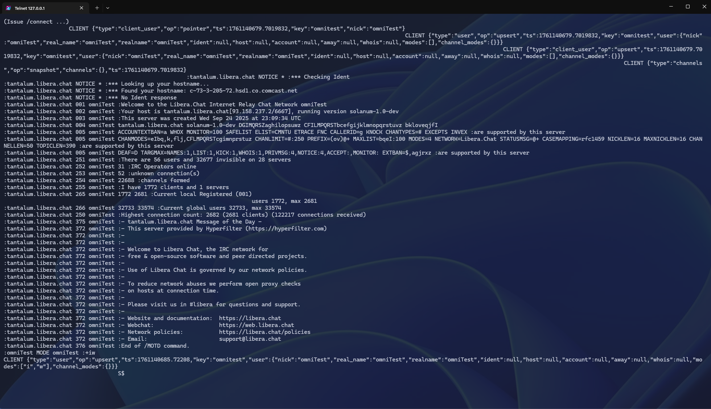
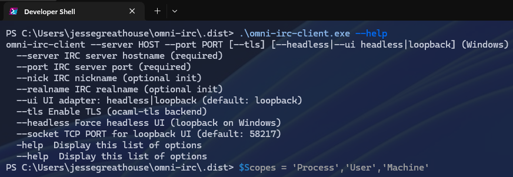
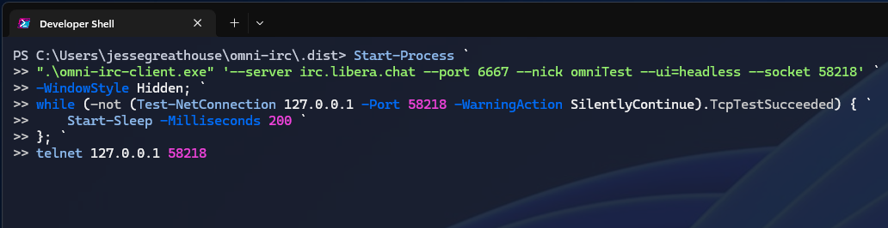

# Omni-IRC — A Modern IRC Client for Developers



---

## Lightweight. Composable. Transparent.

**Omni-IRC** is a modular IRC client and engine written in pure [OCaml](https://ocaml.org).  
It was designed to prove a simple idea:

> _IRC can be just as composable, inspectable, and automatable as any modern message bus._

Unlike traditional monolithic clients, Omni-IRC breaks the system into **reusable libraries** —  
each handling its own layer: I/O, connector, engine, UI, and orchestration.

---

## 🧠 Architecture at a Glance

Omni-IRC isn’t just “one app.” It’s a **stack of small, composable OCaml libraries** that can be reused or replaced independently.

```text
+------------------------------------------------------------+
|                     omni-irc-client                        |
|  (thin orchestrator wiring IO ⇄ connector ⇄ engine ⇄ UI)   |
+------------------------------------------------------------+
| omni-irc-engine   — parses, models, and dispatches IRC     |
| omni-irc-conn     — uniform connector functor for IO backends|
| omni-irc-io-tcp   — plain TCP IO backend                   |
| omni-irc-io-tls   — TLS IO backend (pure OCaml)            |
| omni-irc-ui       — JSON loopback UI bridge                |
| omni-irc-ui-notty — terminal UI (Linux/macOS)              |
+------------------------------------------------------------+
````

The client communicates with its UI using **JSON snapshots** emitted over a loopback TCP socket.
External GUIs, dashboards, or automation scripts can attach to this port, receive structured events, and issue commands.

---

## ⚡ Quick Start

### Connect to Libera.Chat

```powershell
omni-irc-client.exe --server irc.libera.chat --port 6697 --tls --nick yournick --ui=headless
```

By default, Omni-IRC runs a **loopback UI bridge** on port **58217** (Windows) or **8765** (Linux/macOS).

You can connect to it with a simple telnet or GUI bridge:

```powershell
telnet 127.0.0.1 58217
```

You’ll see IRC traffic and `CLIENT {json}` snapshots in real time.

---

## 🪶 Lightweight and Transparent



Omni-IRC doesn’t hide the protocol.
Instead, it exposes every IRC event as structured JSON — perfect for embedding, debugging, or building your own UI around.

The bundled **Notty UI** (on POSIX systems) provides a simple text interface, while Windows uses a headless loopback bridge for frontends like Electron or web-based dashboards.

---

## 🔍 Inspecting the Flow

Each connected client emits structured messages to the loopback interface:

```json
{"type":"client_user","op":"upsert","user":{"nick":"omniTest","real_name":"omniTest"}}
{"type":"channels","op":"snapshot","channels":{}}
```

This snapshot-driven model keeps the UI stateless:
the client owns the truth; the UI just reacts.



---

## 🧩 Designed for Integration

Omni-IRC is ideal for:

* **Custom dashboards** – use the loopback socket to render live IRC data in a web UI.
* **Automation** – script reactions to IRC events in any language that can read JSON.
* **Testing harnesses** – simulate IRC servers or user sessions via the AF_UNIX/TCP interfaces.
* **Educational use** – explore IRC internals, model design, and event flow clearly.

---

## 🔒 Privacy & Simplicity

Omni-IRC collects **no telemetry, no analytics, and no personal data**.
All settings stay local to your device.

See the full [Privacy Policy](privacy-policy.md).

---

## 🧰 Build From Source

```bash
opam pin add omni-irc git+https://github.com/jesse-greathouse/omni-irc.git#main -y
opam install omni-irc-client
```

You can also build locally:

```bash
dune build
dune exec omni-irc-client
```

---

## 🌍 Learn More

* [UI/Client Contract (PDF)](omni-irc-UI-Client-Contract.pdf) — JSON schema of all emitted events
* [README.md](../README.md) — full architecture and development guide
* [Privacy Policy](privacy-policy.md)

---

## ✨ Summary

Omni-IRC reimagines IRC as a **modern, modular communication substrate** —
a lightweight bridge between classic real-time messaging and modern event-driven architectures.

Whether you want to **connect, embed, automate, or extend**, Omni-IRC gives you the building blocks.

---

© 2025 **Greathouse Technology** — All rights reserved.
Licensed under **LicenseRef-OmniIRC-ViewOnly-1.0**
